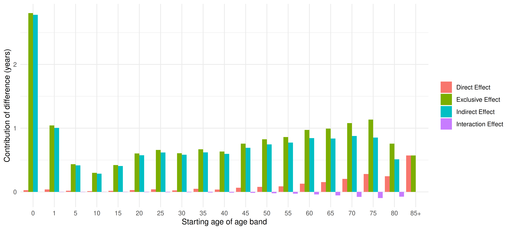
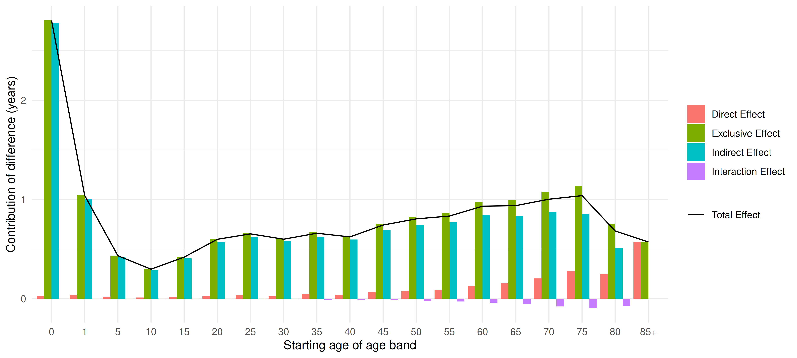
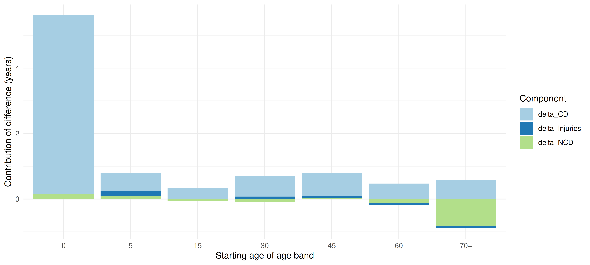
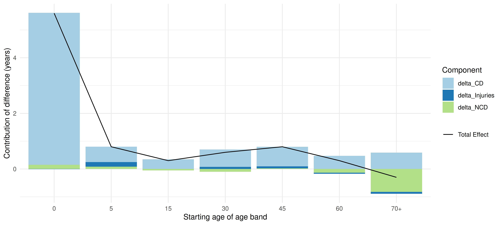

<!-- README.md is generated from README.Rmd. Please edit that file -->

# decompositionLE 

<!-- badges: start -->

[](https://CRAN.R-project.org/package=decompositionLE)
[](https://app.codecov.io/gh/herts-phei/decompositionLE)
[](https://github.com/herts-phei/decompositionLE/actions/workflows/R-CMD-check.yaml)
<!-- badges: end -->

The goal of **decompositionLE** is to provide an easy to use
implementation of life expectancy decomposition formulas for age bands,
derived from *Ponnapalli, K. (2005)* In addition, there is a
decomposition function for disease cause breakdown sourced from
*Preston, S.H., Heuveline, P. and Guillot, M. (2001)*, as well as some
useful helper plot functions.

## Installation

You can install the development version of decompositionLE from
[GitHub](https://github.com/) with:

``` r
devtools::install_github("herts-phei/decompositionLE")
```

## Example

### Age decomposition

The package contains a built-in dataset of life table values for US
women born in 1935 and 1995, `us_females`, sourced from *Ponnapalli, K.
(2005)*.

``` r
us_females
#>    Age     nm1x     l1x   e1x     nm2x     l2x   e2x
#> 1    0 0.047139 1.00000 63.32 0.006830 1.00000 79.00
#> 2    1 0.004157 0.95458 65.32 0.000358 0.99321 78.54
#> 3    5 0.001525 0.93887 62.39 0.000167 0.99179 74.65
#> 4   10 0.001208 0.93174 57.85 0.000196 0.99096 69.71
#> 5   15 0.002022 0.92613 53.19 0.000459 0.98999 64.78
#> 6   20 0.002944 0.91681 48.70 0.000503 0.98772 59.92
#> 7   25 0.003562 0.90341 44.38 0.000647 0.98524 55.06
#> 8   30 0.003980 0.88746 40.14 0.000892 0.98206 50.23
#> 9   35 0.005003 0.86997 35.89 0.001266 0.97769 45.45
#> 10  40 0.005927 0.84847 31.74 0.001765 0.97152 40.72
#> 11  45 0.008310 0.82368 27.61 0.002612 0.96298 36.06
#> 12  50 0.011638 0.79012 23.67 0.004171 0.95048 31.49
#> 13  55 0.016309 0.74539 19.94 0.006575 0.93085 27.10
#> 14  60 0.024373 0.68688 16.41 0.010387 0.90071 22.92
#> 15  65 0.035823 0.60779 13.21 0.016349 0.85504 19.00
#> 16  70 0.055769 0.50757 10.31 0.024504 0.78775 15.40
#> 17  75 0.092454 0.38276  7.82 0.038841 0.69655 12.07
#> 18  80 0.130808 0.23930  6.03 0.063900 0.57275  9.12
#> 19 85+ 0.222482 0.12281  4.49 0.151106 0.41424  6.62
```

The dataset demonstrates usage of `decomp_age()`.

``` r
age_output <- decomp_age(us_females, method = "arriaga3", 
           age_col = "Age", e1 = "e1x", e2 = "e2x", l1 = "l1x", l2 = "l2x")

age_output
#>    Age     nm1x     l1x   e1x     nm2x     l2x   e2x direct_effect
#> 1    0 0.047139 1.00000 63.32 0.006830 1.00000 79.00    0.02645220
#> 2    1 0.004157 0.95458 65.32 0.000358 0.99321 78.54    0.03890153
#> 3    5 0.001525 0.93887 62.39 0.000167 0.99179 74.65    0.01835259
#> 4   10 0.001208 0.93174 57.85 0.000196 0.99096 69.71    0.01264484
#> 5   15 0.002022 0.92613 53.19 0.000459 0.98999 64.78    0.01658115
#> 6   20 0.002944 0.91681 48.70 0.000503 0.98772 59.92    0.02818036
#> 7   25 0.003562 0.90341 44.38 0.000647 0.98524 55.06    0.04102099
#> 8   30 0.003980 0.88746 40.14 0.000892 0.98206 50.23    0.02330090
#> 9   35 0.005003 0.86997 35.89 0.001266 0.97769 45.45    0.04856497
#> 10  40 0.005927 0.84847 31.74 0.001765 0.97152 40.72    0.03666408
#> 11  45 0.008310 0.82368 27.61 0.002612 0.96298 36.06    0.06641661
#> 12  50 0.011638 0.79012 23.67 0.004171 0.95048 31.49    0.07906885
#> 13  55 0.016309 0.74539 19.94 0.006575 0.93085 27.10    0.08717324
#> 14  60 0.024373 0.68688 16.41 0.010387 0.90071 22.92    0.12886018
#> 15  65 0.035823 0.60779 13.21 0.016349 0.85504 19.00    0.15499332
#> 16  70 0.055769 0.50757 10.31 0.024504 0.78775 15.40    0.20366438
#> 17  75 0.092454 0.38276  7.82 0.038841 0.69655 12.07    0.28108338
#> 18  80 0.130808 0.23930  6.03 0.063900 0.57275  9.12    0.24621067
#> 19 85+ 0.222482 0.12281  4.49 0.151106 0.41424  6.62    0.57195825
#>    indirect_effect exclusive_effect interaction_effect total_effect
#> 1        2.7786559        2.8051081        0.000000000    2.8051081
#> 2        1.0046032        1.0435047       -0.003558610    1.0399461
#> 3        0.4171028        0.4354554       -0.002120567    0.4333348
#> 4        0.2867811        0.2994260       -0.001730363    0.2976956
#> 5        0.4057047        0.4222859       -0.002783792    0.4195021
#> 6        0.5754256        0.6036060       -0.004583696    0.5990223
#> 7        0.6185978        0.6596188       -0.005956216    0.6536626
#> 8        0.5835122        0.6068131       -0.006899530    0.5999136
#> 9        0.6203954        0.6689604       -0.008900702    0.6600597
#> 10       0.5970722        0.6337363       -0.010619689    0.6231166
#> 11       0.6915976        0.7580142       -0.015121718    0.7428925
#> 12       0.7463816        0.8254504       -0.020643620    0.8048068
#> 13       0.7740000        0.8611732       -0.027839442    0.8333338
#> 14       0.8437428        0.9726030       -0.039890424    0.9327126
#> 15       0.8375481        0.9925414       -0.054237938    0.9383034
#> 16       0.8768650        1.0805294       -0.077473759    1.0030556
#> 17       0.8533742        1.1344576       -0.095541086    1.0389165
#> 18       0.5110394        0.7572501       -0.074591117    0.6826590
#> 19              NA        0.5719583                 NA    0.5719583
```

In `decomp_age()`, there are several methods currently available:
`arriaga3`, `chandrasekaran1` or `chandrasekaran2`. Functionally, they
produce close to identical results, but the output variables are
different.

`age_col` should be a factor column providing ordered age bands with the
final age group being an open-ended interval suffixed with ‘+’,
e.g. `90+`. `e1` and `l1` correspond to the expectation of life at age
group x, and the proportion of persons alive at age group x in decimal
form, in the first group of comparison, and likewise for `e2` and `l2`
for the second group of comparison.

There is also a helpful plot function for output from `decomp_age()`
offering a variety of basic ggplot2 style plots.

``` r
library(patchwork)

plot1 <- plot_age(age_output, method = "arriaga3", plot_type = "segment_dodge")
plot2 <- plot_age(age_output, method = "arriaga3", plot_type = "segment_dodge", line = TRUE)
plot3 <- plot_age(age_output, method = "arriaga3", plot_type = "total", line = TRUE)

plot1
```



``` r
plot2
```



``` r
plot3
```


### Disease decomposition

The package also contains a built-in dataset of age and cause
decomposition of difference in Life Expectancies at birth, for India and
China, males, 1990, `india_china_males_1990`, sourced from *Murray,
C.J.L. and Lopez, A.D. (1996)*.

``` r
india_china_males_1990
#>   Age India_nmx India_CD India_NCD India_Injuries China_nmx China_CD China_NCD
#> 1   0    0.0267    0.882     0.073          0.046    0.0084    0.677     0.174
#> 2   5    0.0025    0.504     0.188          0.309    0.0009    0.174     0.337
#> 3  15    0.0021    0.382     0.223          0.394    0.0015    0.068     0.380
#> 4  30    0.0043    0.429     0.315          0.257    0.0028    0.101     0.573
#> 5  45    0.0139    0.304     0.592          0.104    0.0102    0.095     0.796
#> 6  60    0.0388    0.248     0.722          0.030    0.0342    0.070     0.879
#> 7 70+    0.0929    0.247     0.728          0.025    0.1003    0.084     0.877
#>   China_Injuries  nDx
#> 1          0.149  5.6
#> 2          0.488  0.8
#> 3          0.552  0.3
#> 4          0.326  0.6
#> 5          0.109  0.8
#> 6          0.051  0.3
#> 7          0.039 -0.3
```

The dataset demonstrates usage of `decomp_disease()`.

``` r
disease_output <- decomp_disease(india_china_males_1990,
  breakdown = "proportion", 
  age_col = "Age",
  diseases = c("CD", "NCD", "Injuries"),
  group_1 = "India", group_1_m = "India_nmx", 
  group_2 = "China", group_2_m = "China_nmx", 
  nDx = "nDx"
)

disease_output
#>   Age India_nmx India_CD India_NCD India_Injuries China_nmx China_CD China_NCD
#> 1   0    0.0267    0.882     0.073          0.046    0.0084    0.677     0.174
#> 2   5    0.0025    0.504     0.188          0.309    0.0009    0.174     0.337
#> 3  15    0.0021    0.382     0.223          0.394    0.0015    0.068     0.380
#> 4  30    0.0043    0.429     0.315          0.257    0.0028    0.101     0.573
#> 5  45    0.0139    0.304     0.592          0.104    0.0102    0.095     0.796
#> 6  60    0.0388    0.248     0.722          0.030    0.0342    0.070     0.879
#> 7 70+    0.0929    0.247     0.728          0.025    0.1003    0.084     0.877
#>   China_Injuries  nDx  delta_CD  delta_NCD delta_Injuries
#> 1          0.149  5.6 5.4661508  0.1491803   -0.007160656
#> 2          0.488  0.8 0.5517000  0.0833500    0.166650000
#> 3          0.552  0.3 0.3501000 -0.0508500   -0.000300000
#> 4          0.326  0.6 0.6247600 -0.0999600    0.076920000
#> 5          0.109  0.8 0.7041297  0.0236973    0.072172973
#> 6          0.051  0.3 0.4714174 -0.1335783   -0.037839130
#> 7          0.039 -0.3 0.5886932 -0.8242662   -0.064427027
```

The `diseases` argument provides the function with suffixes of relevant
diseases found in both groups of interest. `breakdown` is for whether
disease breakdowns are `raw` mortality rates or a decimal `proportion`
of the total all-cause mortality rate. For example, in the
`india_china_males_1990` dataset which has decimal proportion
breakdowns:

``` r
india_china_males_1990[1,]
#>   Age India_nmx India_CD India_NCD India_Injuries China_nmx China_CD China_NCD
#> 1   0    0.0267    0.882     0.073          0.046    0.0084    0.677     0.174
#>   China_Injuries nDx
#> 1          0.149 5.6
```

At birth, the components which make up India’s all-cause mortality in
the dataset:

``` r
india_birth_components_equal_1 <- india_china_males_1990[1,c("India_CD", "India_NCD", "India_Injuries")]

all.equal(sum(india_birth_components_equal_1), 1, tolerance = 1e-3)
#> [1] TRUE
```

Within tolerance, is equal to 1. Likewise, for China all-cause mortality
at birth:

``` r
china_birth_components_equal_1 <- india_china_males_1990[1,c("China_CD", "China_NCD", "China_Injuries")]

all.equal(sum(china_birth_components_equal_1), 1, tolerance = 1e-3)
#> [1] TRUE
```

However raw disease breakdowns are also accepted if provided, but these
disease breakdowns should then equal the value provided in the column
for the all-cause mortality rate for the specified group instead, not 1.

Likewise in `decomp_age()`, `age_col` should be a factor column
providing ordered age bands with the final age group being an open-ended
interval suffixed with ‘+’.

The `diseases` argument specifies a character vector of the diseases
found in both groups, and should be suffixed at the end of the names
given in `group_1` and `group_2` in the dataset. In
`india_china_males_1990`, these are: `c("CD", "NCD", "Injuries")`.

There is a also a helper plot function for disease decomposition output,
`plot_disease()`:

``` r

plot_disease(x = disease_output, suffixes = c("delta_CD", "delta_NCD", "delta_Injuries"), nDx = "nDx", line = FALSE) 
```



``` r

plot_disease(x = disease_output, suffixes = c("delta_CD", "delta_NCD", "delta_Injuries"), nDx = "nDx", line = TRUE)
```



## References

*Ponnapalli, K. (2005). A comparison of different methods for
decomposition of changes in expectation of life at birth and
differentials in life expectancy at birth. Demographic Research, 12,
pp.141–172. doi: <https://doi.org/10.4054/demres.2005.12.7>.*

*Preston, S.H., Heuveline, P. and Guillot, M. (2001). Demography :
measuring and modeling population processes. Oxford ; Malden, Mass.:
Blackwell Publishers.*
